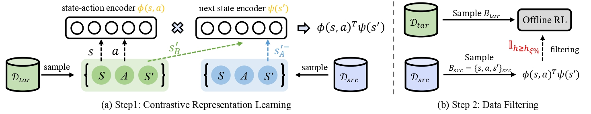
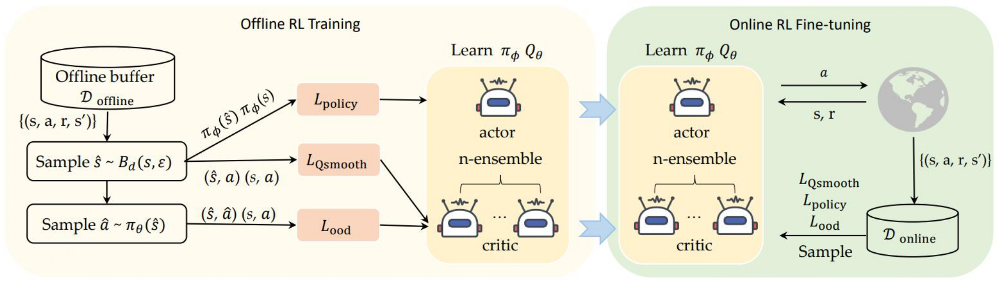



<strong><a href="https://arxiv.org/pdf/2405.06192">Contrastive representation for data filtering in cross-domain offline reinforcement learning</a></strong>

<b>Xiaoyu Wen</b>, Chenjia Bai, Kang Xu, Xudong Yu, Yang Zhang, Xuelong Li, Zhen Wang.

<em>ICML</em>, 2024

<a href="https://arxiv.org/pdf/2405.06192">pdf</a> | <a href="https://github.com/BattleWen/IGDF">code</a>

<strong><a href="[https://arxiv.org/pdf/2309.16973](https://drive.google.com/file/d/128J7EMpVGOgl6VlV2CJA3lumMpotgoHw/view?usp=drive_link)">Towards robust offline-to-online reinforcement learning via uncertainty and smoothness</a></strong>
  
<b>Xiaoyu Wen</b>, Xudong Yu, Rui Yang, Chenjia Bai, Zhen Wang

<em>JAIR</em>, 2024

<a href="https://drive.google.com/file/d/128J7EMpVGOgl6VlV2CJA3lumMpotgoHw/view?usp=drive_link">pdf</a> | <a href="https://github.com/BattleWen/RO2O">code</a>

